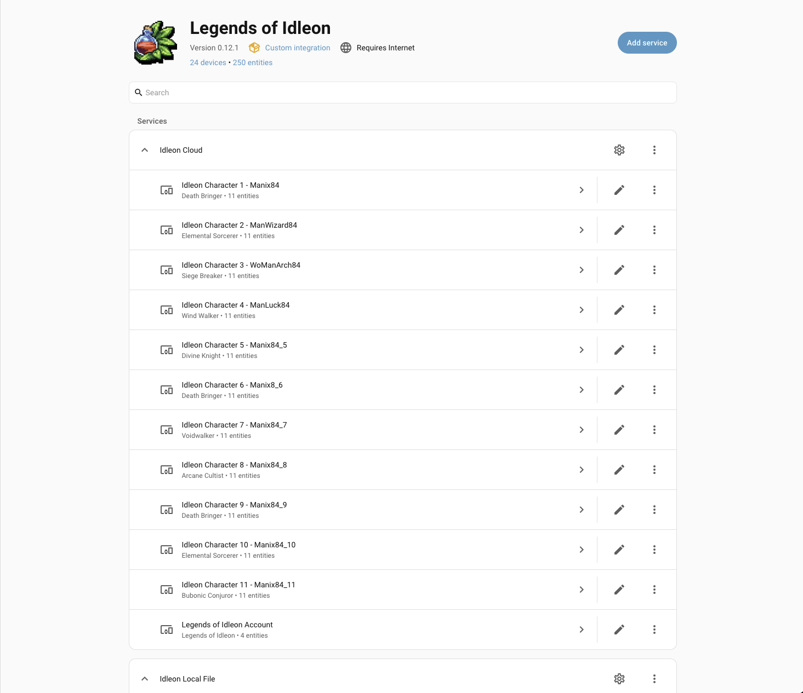
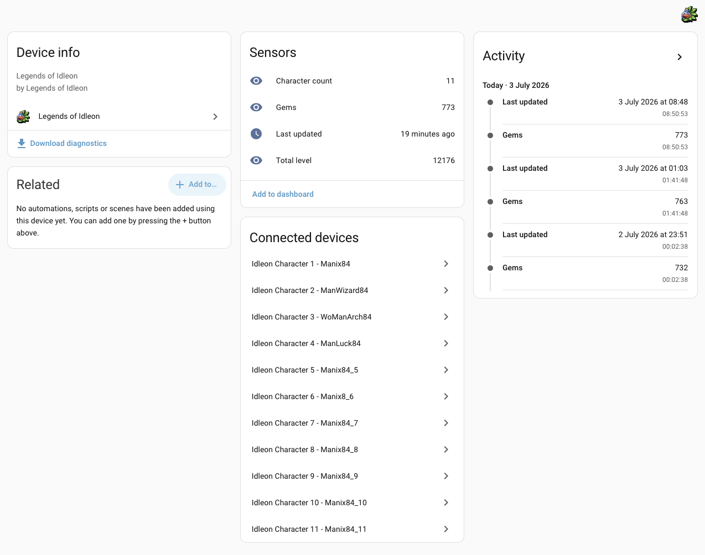
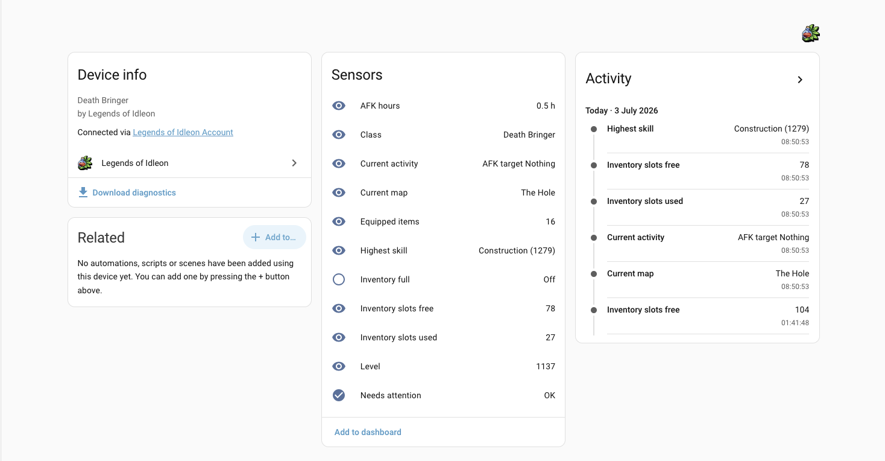

# 🕹️ HA Idleon

<p align="center">
  
</p>

<p align="center">
  
  
  
  
  <br />
  <a href="https://github.com/manix84/ha-idleon/actions/workflows/lint.yml"></a>
  <a href="https://github.com/manix84/ha-idleon/actions/workflows/type-check.yml"></a>
  <a href="https://github.com/manix84/ha-idleon/actions/workflows/test.yml"></a>
  <a href="https://github.com/manix84/ha-idleon/actions/workflows/release-check.yml"></a>
  <a href="https://github.com/manix84/ha-idleon/actions/workflows/release.yml"></a>
</p>

Home Assistant integration for Legends of Idleon account and character stats.

This custom integration is experimental. It is not official to Legends of Idleon,
Lavaflame2, or any Idleon service provider.

The project icon is generated from Idleon artwork for recognizability, but this
project remains unofficial and community-maintained.

## 🚀 Quick Start

After installing through HACS or manually copying the integration, restart Home
Assistant and add **Legends of Idleon** from **Settings -> Devices & services**.

1. Choose a login provider. Google and email are the primary options; Steam and
   Apple are experimental while more account types are tested.
2. Complete the provider login flow. The integration stores a Firebase refresh
   token so Home Assistant can poll your read-only Idleon cloud save.
3. Choose the refresh interval. The default is `300` seconds.
4. Open the created **Legends of Idleon Account** device to see account-wide
   sensors and connected character devices.
5. Open each **Idleon Character <number> - <name>** device for level, class,
   map, activity, AFK time, inventory, equipment, skill, and attention sensors.

The integration is designed for normal Home Assistant usage: add the entities
you care about to dashboards, use diagnostics from the device page when
debugging, and keep noisy/detail-heavy values as attributes instead of hundreds
of separate default entities.

### 📸 What You Should See

<p>
  <a href="docs/screenshots/integration-devices.png">
    
  </a>
  <a href="docs/screenshots/account-device.png">
    
  </a>
  <a href="docs/screenshots/character-device.png">
    
  </a>
</p>

## ✨ What It Does

HA Idleon reads a JSON representation of your Idleon account data and creates
Home Assistant devices and entities for basic account and character status.

🔒 The integration is read-only. The cloud setup uses Idleon email/password,
Google device authorization, or an experimental Steam/Apple authorization flow
once to store a Firebase refresh token for future polling. Users should not
paste private session tokens. Raw Idleon account data may contain sensitive
game/account details.

The intended primary setup is an authenticated Idleon cloud data source, using
the same style of login users already use for Idleon. The current `local_file`
and `remote_url` sources remain transitional development and fallback options.

## 📦 Installation

### 🧩 HACS Custom Repository

1. Open HACS in Home Assistant.
2. Go to the custom repositories menu.
3. Add this repository URL as an `Integration` repository.
4. Install `HA Idleon`.
5. Restart Home Assistant.
6. Add the integration from Settings -> Devices & services.

### 🛠️ Manual Installation

1. Copy `custom_components/idleon` into your Home Assistant
   `custom_components` directory.
2. Restart Home Assistant.
3. Add the integration from Settings -> Devices & services.

## ⚙️ Configuration

The integration is configured through the Home Assistant UI. YAML-only setup is
not supported.

Fields:

- `data_source_type`: choose `google`, `apple`, `email`, `steam`, or
  `local_file` in the UI. Cloud login entries are stored internally as
  `idleon_cloud` with an auth provider.
- `idleon_email`: required when using the `email` provider
- `idleon_password`: required during `email` setup and not stored after a
  successful token exchange
- `local_file_path`: required when using `local_file`
- `scan_interval`: defaults to `300` seconds. The minimum is `300` seconds.

The integration validates the source before creating the config entry.

## 📡 Data Sources

### 🔑 Authenticated Idleon Cloud

The primary data source is authenticated cloud login, where Home Assistant logs
in through an Idleon-supported provider and fetches read-only cloud save data.

Supported providers:

- `email`: exchanges your Idleon email/password for Firebase tokens. The
  account password is not stored after setup.
- `google`: shows a Google device-code login prompt, exchanges the completed
  Google authorization for Firebase tokens, and stores only the Firebase refresh
  token for future polling.
- `steam` experimental: opens Steam as a Home Assistant external setup step.
  After Steam authorization, Steam redirects back to Home Assistant, which
  exchanges the returned OpenID data for Firebase tokens and stores only the
  refresh token.
- `apple` experimental: starts Idleon's Apple sign-in handoff, opens Apple Sign
  In, then checks Idleon's authorization status when you return to Home
  Assistant. Only the Firebase refresh token is stored after setup.

See [docs/auth-data-source.md](docs/auth-data-source.md) for the design notes
and future provider plan.

### 📄 Local File

Use `local_file` when Home Assistant can read a JSON file from disk. This is
currently useful for development and early testing, but it is not intended to be
the final user setup. The path
must be readable by the Home Assistant process and must be the path as seen
from the Home Assistant server, not your workstation. For a typical Home
Assistant config directory, place the file somewhere like
`/config/idleon/real_data.json` and enter that exact path in the config flow.

### 🌐 Remote URL

Use `remote_url` when Home Assistant can fetch a JSON document over HTTP or
HTTPS. This is currently useful for testing private JSON publishing workflows,
but it is not intended to be the final user setup. Do not use URLs containing
private session tokens or account secrets.

The integration must not implement browser scraping, session scraping, or token
scraping.

## 🧭 Entities

One account device is created:

- `Legends of Idleon Account`

One device is created per character:

- `Idleon Character <number> - <character name>` for indexed Idleon exports
- `Idleon Character - <character name>` for sources without character indexes

Account sensors:

- Total level
- Character count
- Gems
- Highest character level
- Total skill level
- Money, formatted with Idleon's large-number suffixes
- Money raw, preserving the exact copper value as a string
- Green stacks
- Slab items obtained
- Achievements completed
- Currencies
- Shrine levels
- Statue levels
- Colosseum scores
- Minigame scores
- Progress totals
- Pets
- Achievements completed, with world progress attributes where available
- Task levels
- Taskboard merits
- Taskboard unlocks
- World 1 anvil
- World 1 bribes
- World 1 stamps
- World summaries
- World 2 cauldron
- World 2 vials
- World 2 bubbles
- World 2 sigils
- World 2 vote ballots
- World 2 Killroy
- World 3 printer
- World 3 refinery
- World 3 atom collider
- World 3 equinox
- World 3 buildings
- World 3 death note
- World 3 worship
- World 3 prayers
- World 3 traps
- World 3 salt lick
- World 3 construction
- World 3 armor smithy
- World 3 hat rack
- World 4 cooking
- World 4 breeding
- World 4 laboratory
- World 4 rift
- World 4 tome
- World 5 sailing
- World 5 divinity
- World 5 gaming
- World 5 hole
- World 5 slab
- World 6 farming
- World 6 sneaking
- World 6 summoning
- World 6 beanstalk
- World 6 emperor
- World 7 spelunking
- World 7 research
- World 7 gallery
- World 7 legend talents
- World 7 coral reef
- World 7 zenith market
- World 7 clam work
- World 7 advice fish
- World 7 minehead
- World 7 glimbo
- World 7 sushi station
- World 7 the button
- Last updated is available but disabled by default because diagnostics now
  exposes the same timestamp for troubleshooting

Character sensors:

- Level
- Class
- Current map
- Current activity
- AFK hours
- Inventory slots used/free
- Highest skill
- Total skill level
- Money, formatted with Idleon's large-number suffixes
- Money raw, preserving the exact copper value as a string
- Equipped items
- Strength, agility, wisdom, and luck sensors are available but disabled by
  default

Character binary sensors:

- Inventory full
- Needs attention

Related entities expose compact attributes for detailed data that is useful to
inspect but too noisy to promote to separate entities. Class IDs are attached to
the class sensor, map IDs to the current map sensor, AFK target/timing details
to the activity and AFK sensors, and inventory slot/bag/carry details to the
inventory-full binary sensor.

The integration avoids raw JSON dumps and does not create hundreds of default
entities.

### 🔢 Number Formatting

Large Idleon values should use
`custom_components/idleon/utils/number_format.py`. Use
`format_idleon_number()` for generic Idleon suffixes and
`format_idleon_money()` for copper coin values. Keep exact source values in a
paired `_raw` sensor or `raw_value` attribute so precision is never lost.

Money sensors follow this pattern:

- `money`: formatted display value, such as `987.65K`
- `money_raw`: exact copper value as a string

Formatted money sensors expose `raw_value`, `coin_tier_formatted`,
`coin_tier`, `coin_tier_value`, `formatted_number`, `number_suffix`, and
`number_mantissa` attributes. Formatted money is intentionally not a numeric
Home Assistant state because large Idleon values can exceed JavaScript-safe
integer limits.

Money sensors also set their entity picture to the bundled image for the
current coin tier, served locally by Home Assistant from `/idleon_static/`.

## 🔐 Privacy And Security

HA Idleon stores the configured data source in the Home Assistant config entry.
For authenticated cloud login, this includes the auth provider, redacted email
metadata, Idleon/Firebase user id metadata, and refresh-token presence. The
refresh token itself is stored by Home Assistant so the integration can keep
polling; keep access to your Home Assistant config private.

Diagnostics redact local file paths, remote URL query strings, auth user
metadata, and token presence because these may expose usernames, tokens, or
private infrastructure.

Raw Idleon account JSON may contain sensitive game/account details. Keep source
files private and do not publish diagnostics that include unreviewed data from
future versions.

Third-party data notices are listed in
[THIRD_PARTY_NOTICES.md](THIRD_PARTY_NOTICES.md).

## 🚧 Known Limitations

- Email/password and Google are the primary cloud login providers.
- Apple and Steam are implemented but experimental until validated against more
  real-world linked accounts.
- Steam setup requires Home Assistant to have an HTTPS external URL so Steam can
  redirect back to the config flow.
- Apple setup returns to Idleon's own authorization endpoint, so you need to
  return to Home Assistant and submit the setup form after completing Apple Sign
  In.
- The parser is flexible but may still need updates for new data domains.
- No write actions, services, automations, or cloud storage are included.
- Newly discovered characters are added after a successful refresh, but removed
  characters may leave disabled or unavailable registry entries behind.

## 🧾 Troubleshooting Experimental Login

Steam and Apple setup failures should write warning-level logs without exposing
tokens or raw account data. If a setup flow fails, check Home Assistant logs for:

- `Steam authorization`
- `Steam custom-token exchange failed`
- `Steam Firebase custom-token sign-in failed`
- `Apple authorization`

For deeper handoff debugging, temporarily enable debug logging:

```yaml
logger:
  logs:
    custom_components.idleon.config_flow: debug
    custom_components.idleon.idleon_data.cloud: debug
```

Debug logs include provider stage breadcrumbs, but they still avoid returned
tokens and raw save data. Turn debug logging back off after testing.

## 🗺️ Roadmap

- Expand authenticated cloud-source coverage beyond the initial save data.
- Harden provider callback and handoff error handling as more real-world
  accounts are tested.
- Expand typed models without creating noisy default entities.
- Add more account and character metrics disabled by default where appropriate.
- Improve repair messages for invalid or stale data sources.

## 🧪 Development

Install test dependencies in a Python 3.14 environment, then run:

```sh
python -m pip install -r requirements_test.txt
scripts/install-hooks
scripts/check
```

Convenience targets are also available through `make`:

```sh
make check
make test
make debug
```

The primary task runner is [`just`](https://github.com/casey/just), which is
also used by the VS Code tasks in `.vscode/tasks.json`:

```sh
just --list
just validate
just deploy-ha-share
just test
just lint
just format
just typecheck
just debug
just debug-watch
just website-data-split
just icons
just build
```

VS Code users can run the same commands from **Tasks: Run Task**. The tasks are
also compatible with the Task Explorer extension.

Targets can pass common arguments through variables:

```sh
make test PYTEST_ARGS=tests/test_parser.py
make inspect INSPECT_FILE=examples/rawData.json
make debug DEBUG_ARGS="--output-dir /tmp/idleon-debug"
```

Equivalent `just` examples:

```sh
just test tests/test_parser.py
just inspect examples/rawData.json
just debug --output-dir /tmp/idleon-debug
just debug-watch
just website-data-split
```

`just debug` builds `debug/parsed-data.html` once. `just debug-watch` keeps
running and regenerates `debug/parsed-data.html` when parser code, fixtures, or
local example data changes. In watch mode the generated HTML includes a short
browser refresh interval, so an open `debug/parsed-data.html` tab updates as you
work.

If you have a local `examples/websiteData.json` capture, `just
website-data-split` writes one file per top-level key into
`examples/websiteData/`. When `examples/websiteData.d.json.ts` is present, the
splitter also writes adjacent `.d.ts` and `.pyi` type files, plus a
`_manifest.json` connecting each JSON part to its TypeScript and Python type
references. Python code can read a split part with `load_website_data_part()`
from `custom_components.idleon.idleon_data`.

When the split data is present locally, the parser uses `classes`, `mapNames`,
and `monsters` to turn raw Idleon IDs into readable class, map, and activity
labels. Packaged installs still use small built-in fallback labels so Home
Assistant does not depend on the ignored example data directory.

The source file and generated directory are ignored because the data is large
and only used as a local mapping reference.

If you have the IdleonToolbox checkout at
`/Users/rob/Workspace/Personal/IdleonToolbox/parsers`, refresh the Python parser
definition snapshot with:

```sh
scripts/import-toolbox-parsers
```

This creates the full metadata-mode parser surface under
`custom_components/idleon/idleon_data/toolbox_parsers/`, including parser IDs,
source paths, exported function names, raw Idleon fields, and websiteData
dependencies.

Individual checks are available as:

```sh
scripts/lint
scripts/format
scripts/format-check
scripts/type-check
scripts/test
scripts/release-check
```

To inspect how the current parser sees local example data, generate ignored
debug files:

```sh
scripts/render-debug-parsed-data
open debug/parsed-data.html
```

By default this reads `examples/rawData.json` and `examples/real_data*.json`
when present. If `examples/cleanData.json` exists, the HTML report includes it
as a clean parsed reference. The report also includes an IdleonToolbox parser
section table showing which generated parser sections matched raw fields in the
capture. The generated `debug/` directory is ignored because parsed output from
real exports can still contain private account details.

The local pre-commit hook bumps versions automatically for release-affecting
changes:

- docs-only changes do not bump the version.
- internal code changes bump the patch version.
- entity, config flow, model, manifest, strings, and translation changes bump
  the minor version.
- generated `WHATSNEW.md` entries use explicit bullet points from the commit
  message body when present, otherwise they use the commit subject.

Override the hook when needed:

```sh
HA_IDLEON_VERSION_BUMP=minor git commit
HA_IDLEON_VERSION_BUMP=patch git commit
HA_IDLEON_VERSION_BUMP=skip git commit
HA_IDLEON_RELEASE_NOTE="Add useful release note text." git commit
```

For testing in a real Home Assistant instance, see
[Manual Testing](docs/manual-testing.md).
